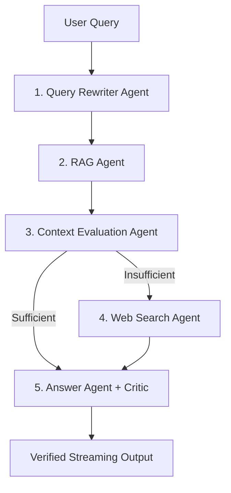

# 🤖 Multi-Agent RAG System Architecture (`AGENTS.md`)

This repository implements a modular, production-ready Multi-Agent Retrieval-Augmented Generation (RAG) system with dynamic evaluation, web fallback search, and fact-checking critic verification.

---

## 🏗️ Agent Pipeline Flow

---

## 🧩 Core Agents & Responsibilities

| Agent | Module | Responsibility |
| :--- | :--- | :--- |
| **Query Rewriter** | `multi_agent/agents/query_rewriter_agent.py` | Expands and optimizes raw queries for document retrieval and web search context. |
| **RAG Agent** | `multi_agent/agents/rag_agent.py` | Performs hybrid BM25 + Vector Search (`BAAI/bge-m3`) with Cross-Encoder Reranking (`BAAI/bge-reranker-v2-m3`). |
| **Context Evaluator**| `multi_agent/agents/evaluation_agent.py` | Evaluates retrieved chunk relevance and sufficiency (`sufficient=True/False`, `confidence: float`). |
| **Web Agent** | `multi_agent/agents/web_agent.py` | Triggers Tavily web search and page cleaning when RAG context is insufficient. |
| **Answer Agent & Critic**| `multi_agent/agents/answer_agent.py` | Generates draft responses and runs a 2nd pass Critic verification for strict factual grounding. |
| **Supervisor** | `multi_agent/agents/supervisor_agent.py` | Orchestrates step execution, fallback routing, and token-by-token SSE streaming. |

---

## 🛠️ API & Interface Endpoints

* `GET /` — Serves custom web workspace (`index.html`).
* `POST /chat` — Handles streaming queries via Server-Sent Events (SSE).
* `GET /api/documents` — Lists indexed documents and metadata.
* `POST /clear` — Resets conversation history session.
